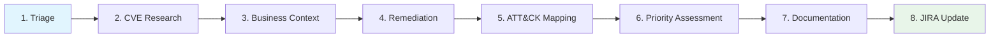
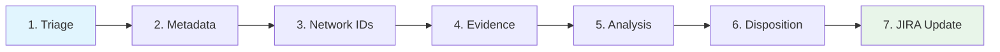
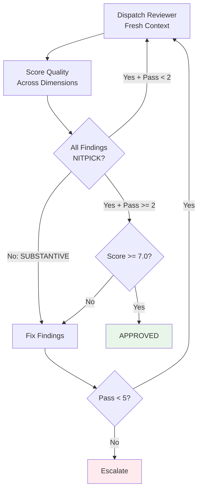

# SecOps Factory

ICS/OT security operations plugin for Claude Code -- CVE enrichment, event investigation, and adversarial quality review.


## What is SecOps Factory?

SecOps Factory is a Claude Code plugin that turns Claude into an ICS/OT security operations analyst. It provides structured, repeatable workflows for vulnerability enrichment and security event investigation, backed by authoritative intelligence sources (NVD, CISA KEV, FIRST EPSS, MITRE ATT&CK) via MCP server integrations.

The plugin enforces quality through adversarial convergence review -- a multi-pass review loop where a separate reviewer agent evaluates analysis quality with fresh context each pass, preventing blind spots from compounding. Every analysis is scored across multiple quality dimensions, and cognitive bias detection is mandatory at every stage.

SecOps Factory connects directly to your JIRA instance for ticket intake and enrichment posting, and uses Perplexity for real-time CVE research and threat intelligence. The result is security analysis that is structured, traceable, and auditable -- not freeform text generation.

## Key Features

- **8-stage CVE enrichment pipeline** -- from JIRA ticket triage through CVSS/EPSS/KEV research, business context, remediation planning, ATT&CK mapping, multi-factor priority, documentation, and JIRA update
- **7-stage event investigation pipeline** -- alert triage with auto-detection of ICS/IDS/SIEM platforms, evidence collection, technical analysis, and TP/FP/BTP disposition determination
- **Adversarial convergence review** -- minimum 2-pass review with strict-binary novelty classification (SUBSTANTIVE vs NITPICK) until convergence
- **Cognitive bias detection** -- mandatory bias audit every pass checking for confirmation, anchoring, availability, automation, overconfidence, and recency bias
- **MITRE ATT&CK mapping** -- Enterprise and ICS matrices with T-number references and detection recommendations
- **Multi-factor priority scoring** -- 6-factor algorithm (CVSS + EPSS + KEV + ACR + exposure + exploit status) producing P1-P5 with SLA deadlines
- **8 quality dimensions for CVE enrichment** and **7 weighted dimensions for event investigation** -- scored via dedicated checklists
- **3 enforcement hooks** -- block JIRA updates without review, block saving incomplete enrichment, remind analysts to check cognitive bias after research

## Quick Start

### 1. Install the plugin

**From the marketplace:**

```shell
/plugin marketplace add drbothen/secops-factory
/plugin install secops-factory@secops-factory
```

**Update to latest version:**

```shell
/plugin marketplace update drbothen/secops-factory
/plugin update secops-factory@secops-factory
```

**From source (local development):**

```bash
git clone https://github.com/drbothen/secops-factory.git
claude --plugin-dir ./secops-factory/plugins/secops-factory
```

### 2. Configure MCP servers

SecOps Factory uses `jr` CLI for JIRA and Perplexity MCP for AI-assisted research.

**jr CLI (required):**
Install the [jira-cli](https://github.com/Zious11/jira-cli) Rust CLI and authenticate with `jr auth login`. The plugin calls `jr issue view`, `jr issue edit`, `jr issue comment`, `jr issue move`, `jr issue list`, and `jr issue assets` via Bash.

**Perplexity MCP (recommended):**
Configure the Perplexity MCP server with your API key. The plugin uses `perplexity_search`, `perplexity_ask`, `perplexity_reason`, and `perplexity_research` at different tiers based on CVE severity. If not configured, skills fall back to web search.

### 3. Verify setup

```
/secops-factory:secops-health
```

This checks MCP server availability, data files, templates, checklists, and skills.

### 4. Run your first enrichment

```
/secops-factory:enrich-ticket SEC-1234
```

The plugin reads the JIRA ticket, extracts CVE IDs, researches vulnerability intelligence via Perplexity, assesses business context and priority, maps to MITRE ATT&CK, generates a structured enrichment document, and updates the JIRA ticket.

## Workflow Diagrams

### CVE Enrichment Pipeline (8 Stages)



### Event Investigation Pipeline (7 Stages)



### Adversarial Review Convergence Loop



## Commands

### Enrichment Workflow

| Command | Arguments | Description |
|---------|-----------|-------------|
| `/secops-factory:enrich-ticket` | `<ticket-id>` | Complete 8-stage enrichment workflow for a security ticket |
| `/secops-factory:research-cve` | `<cve-id>` | Deep CVE research using Perplexity (NVD, EPSS, KEV, exploits) |
| `/secops-factory:assess-priority` | `<ticket-id>` | Calculate multi-factor priority P1-P5 with SLA |
| `/secops-factory:map-attack` | `<cve-id>` | Map CVE to MITRE ATT&CK tactics and techniques |

### Investigation Workflow

| Command | Arguments | Description |
|---------|-----------|-------------|
| `/secops-factory:investigate-event` | `<ticket-id>` | Complete 7-stage investigation for security event alerts |

### Review Workflow

| Command | Arguments | Description |
|---------|-----------|-------------|
| `/secops-factory:review-enrichment` | `<ticket-id> [--type=auto\|cve\|event]` | Polymorphic quality review (auto-detects CVE vs event) |
| `/secops-factory:adversarial-review-secops` | `<ticket-id>` | Multi-pass adversarial convergence review |
| `/secops-factory:fact-verify` | `<ticket-id>` | Verify factual claims against authoritative sources |

### Advisory Workflow

| Command | Arguments | Description |
|---------|-----------|-------------|
| `/secops-factory:scan-threats` | `[--sector] [--severity] [--days]` | Scan for emerging threats and identify advisory-worthy items |
| `/secops-factory:create-advisory` | `<topic\|CVE-ID\|URL> [--template path] [--type it\|ics\|combined]` | Create a structured security advisory from a CVE, URL, or topic with IT/ICS/OT/Combined audience support |

### Utility

| Command | Arguments | Description |
|---------|-----------|-------------|
| `/secops-factory:read-ticket` | `<ticket-id>` | Read and extract data from a JIRA security ticket |
| `/secops-factory:update-jira` | `<ticket-id>` | Update JIRA custom fields with enrichment data |
| `/secops-factory:generate-metrics` | `[--period=7d\|30d\|90d]` | Generate security operations metrics and KPIs |
| `/secops-factory:secops-health` | -- | Check plugin health: MCP servers, data files, templates |

## What's Inside

| Category | Count | Contents |
|----------|-------|----------|
| Agents | 3 | security-analyst (Sonnet), security-reviewer (Opus), advisory-writer (Sonnet) |
| Skills | 13 | enrich-ticket, research-cve, assess-priority, map-attack, investigate-event, review-enrichment, fact-verify, read-ticket, update-jira, generate-metrics, adversarial-review-secops, create-advisory, scan-threats |
| Commands | 14 | 13 skill commands + secops-health |
| Hooks | 3 | require-review, enrichment-completeness, bias-check-reminder |
| Knowledge Bases | 8 | CVSS, EPSS, KEV, MITRE ATT&CK, cognitive bias, ICS best practices, priority framework, review standards |
| Templates | 4 | Enrichment, investigation, CVE review report, event review report |
| Checklists | 15 | 8 CVE dimensions, 7 event dimensions |
| Tests | 32 | bats test suite (9 hook tests, 23 skill tests) |

## Plugin Structure

```
plugins/secops-factory/
  .claude-plugin/
    plugin.json
  agents/
    security-analyst.md
    security-reviewer.md
  skills/
    enrich-ticket/SKILL.md
    research-cve/SKILL.md
    assess-priority/SKILL.md
    map-attack/SKILL.md
    investigate-event/SKILL.md
    review-enrichment/SKILL.md
    adversarial-review-secops/SKILL.md
    fact-verify/SKILL.md
    read-ticket/SKILL.md
    update-jira/SKILL.md
    generate-metrics/SKILL.md
  commands/
    enrich-ticket.md
    research-cve.md
    assess-priority.md
    map-attack.md
    investigate-event.md
    review-enrichment.md
    adversarial-review-secops.md
    fact-verify.md
    read-ticket.md
    update-jira.md
    generate-metrics.md
    secops-health.md
  hooks/
    hooks.json
    require-review.sh
    enrichment-completeness.sh
    bias-check-reminder.sh
  data/
    cvss-guide.md
    epss-guide.md
    kev-catalog-guide.md
    mitre-attack-mapping-guide.md
    cognitive-bias-patterns.md
    event-investigation-best-practices.md
    priority-framework.md
    review-best-practices.md
  templates/
    security-enrichment-tmpl.yaml
    event-investigation-tmpl.yaml
    security-review-report-tmpl.yaml
    security-event-investigation-review-report-tmpl.yaml
  checklists/
    technical-accuracy-checklist.md
    completeness-checklist.md
    actionability-checklist.md
    contextualization-checklist.md
    documentation-quality-checklist.md
    attack-mapping-validation-checklist.md
    cognitive-bias-checklist.md
    source-citation-checklist.md
    investigation-completeness-checklist.md
    investigation-technical-accuracy-checklist.md
    disposition-reasoning-checklist.md
    investigation-contextualization-checklist.md
    investigation-methodology-checklist.md
    investigation-documentation-quality-checklist.md
    investigation-cognitive-bias-checklist.md
  rules/
    secops-protocol.md
  docs/
    AGENT-SOUL.md
    guide/
      getting-started.md
      vulnerability-enrichment.md
      event-investigation.md
      adversarial-review.md
      commands-reference.md
      agents-reference.md
      hooks-reference.md
  tests/
    hooks.bats
    skills.bats
    run-all.sh
```

## External Dependencies

### jr CLI (Required)

[jira-cli](https://github.com/Zious11/jira-cli) — Rust CLI for JIRA Cloud. Provides ticket reading, field updates, comment posting, status transitions, and CMDB asset queries.

**Install:**
```bash
cargo install jira-cli-rs
# or download binary from https://github.com/Zious11/jira-cli/releases
```

**Authenticate:**
```bash
jr auth login
```

**Key commands used by the plugin:**
- `jr issue view KEY` — read ticket data
- `jr issue edit KEY --priority X` — update fields
- `jr issue comment KEY "msg" --markdown` — post enrichment/review comments
- `jr issue move KEY STATUS` — transition ticket status
- `jr issue list --jql "..."` — search tickets
- `jr issue assets KEY` — fetch linked CMDB assets

### Perplexity MCP Server (Recommended)

Provides AI-assisted CVE research and fact verification with web-grounded results.

**Required tools:**
- `mcp__perplexity__perplexity_search` -- quick CVE lookups (CVSS <7.0)
- `mcp__perplexity__perplexity_ask` -- quick factual queries
- `mcp__perplexity__perplexity_reason` -- moderate analysis (CVSS 7.0-8.9)
- `mcp__perplexity__perplexity_research` -- deep research (CVSS 9.0+, 2-5 min)

**Configuration:** You need a Perplexity API key.

## Iron Laws

These rules are enforced by hooks and skill logic. They cannot be overridden.

| # | Iron Law | Enforced By |
|---|----------|-------------|
| 1 | No JIRA update without completed enrichment first | enrich-ticket skill |
| 2 | No disposition without evidence chain first | investigate-event skill |
| 3 | No quality sign-off without adversarial convergence first | adversarial-review-secops skill |
| 4 | No approval without fresh-context review first | review-enrichment skill |
| 5 | No JIRA field update without review approval first | require-review hook |
| 6 | No priority assignment without multi-factor assessment first | assess-priority skill |

## Development

### Running tests

The test suite uses [bats](https://github.com/bats-core/bats-core):

```bash
cd plugins/secops-factory/tests
./run-all.sh
```

Or run individual test files:

```bash
bats tests/hooks.bats    # 9 hook tests
bats tests/skills.bats   # 23 skill tests
```

### Plugin health check

```
/secops-factory:secops-health
```

Verifies MCP server availability, all 8 data files, 4 templates, 15 checklists, and 11 skills.

## Documentation

- [Getting Started](docs/guide/getting-started.md)
- [Vulnerability Enrichment Guide](docs/guide/vulnerability-enrichment.md)
- [Event Investigation Guide](docs/guide/event-investigation.md)
- [Adversarial Review Guide](docs/guide/adversarial-review.md)
- [Commands Reference](docs/guide/commands-reference.md)
- [Agents Reference](docs/guide/agents-reference.md)
- [Hooks Reference](docs/guide/hooks-reference.md)

## License

MIT
