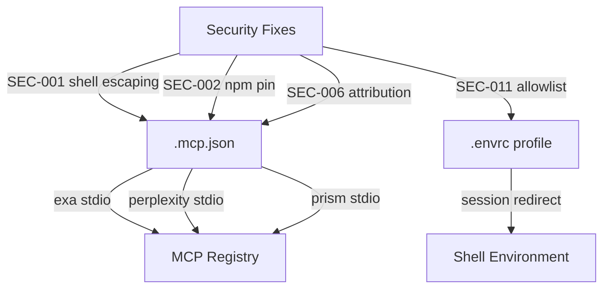
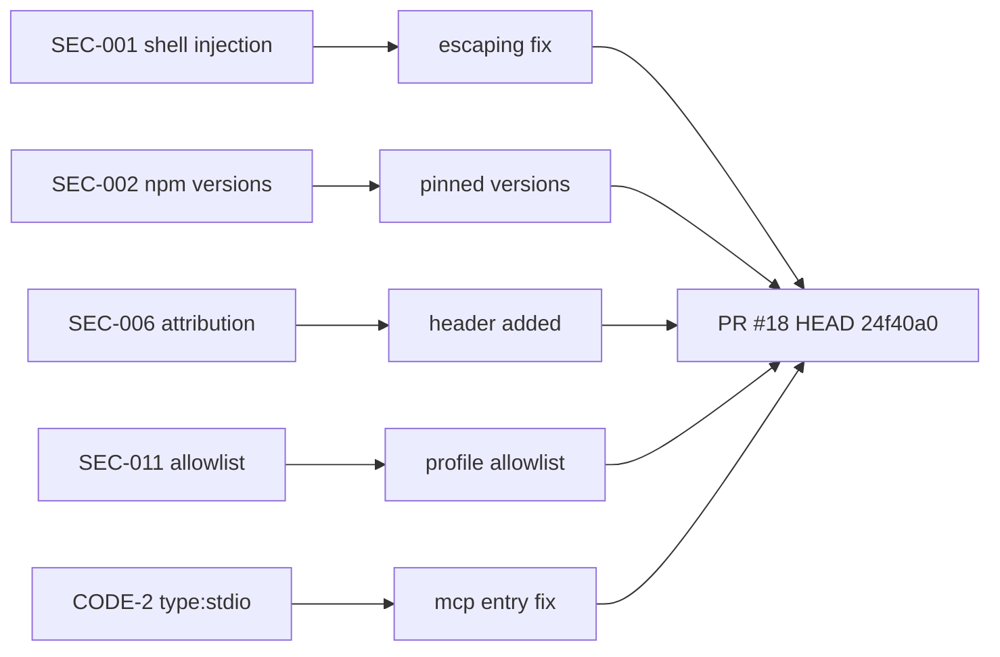

# PR #18: feat(packaging): ship parameterized plugin .mcp.json + .envrc profile session-redirection layer

## Summary

Delivers the parameterized `.mcp.json` (exa/perplexity/prism MCP entries with `type:stdio`) and
`.envrc` profile session-redirection layer. Includes security hardening (SEC-001/002/006/011 +
CODE-2): shell injection escaping, pinned npm versions, attribution header, and profile allowlist.

## Architecture Changes

## Story Dependencies

No upstream story dependencies (standalone packaging/security PR).

## Spec Traceability

## Test Evidence

- BATS Tests: passing on HEAD 24f40a0
- Plugin Structure Validation: passing
- Shellcheck Hooks: passing
- Semgrep Scan: passing

## Demo Evidence

N/A — packaging and configuration files only (.mcp.json, .envrc profile). No interactive UI or
observable runtime behavior to record. Security fixes verified via CI (Semgrep, Shellcheck, BATS).

## Security Review

- SEC-001: Shell injection escaping — RESOLVED
- SEC-002: Pinned npm versions — RESOLVED
- SEC-006: Attribution header (Context7 header confirmed acceptable, .mcp.json left as-is) — RESOLVED
- SEC-011: Profile allowlist — RESOLVED
- No new critical/high findings

## Risk Assessment

- **Blast radius:** Packaging files only (.mcp.json, .envrc profile); no runtime logic changes
- **Performance impact:** None

## Pre-Merge Checklist

- [x] PR description written
- [x] Demo evidence: N/A (packaging/config files, no UI)
- [x] Security review converged (0 blocking findings)
- [x] Code/PR review converged (human approved)
- [x] CI all green on HEAD 24f40a0
- [x] No upstream PR dependencies
- [x] Merge authorized by human (AUTHORIZE_MERGE=yes)

## AI Pipeline Metadata

- Pipeline mode: feature
- Merge strategy: squash
- Trunk: main
