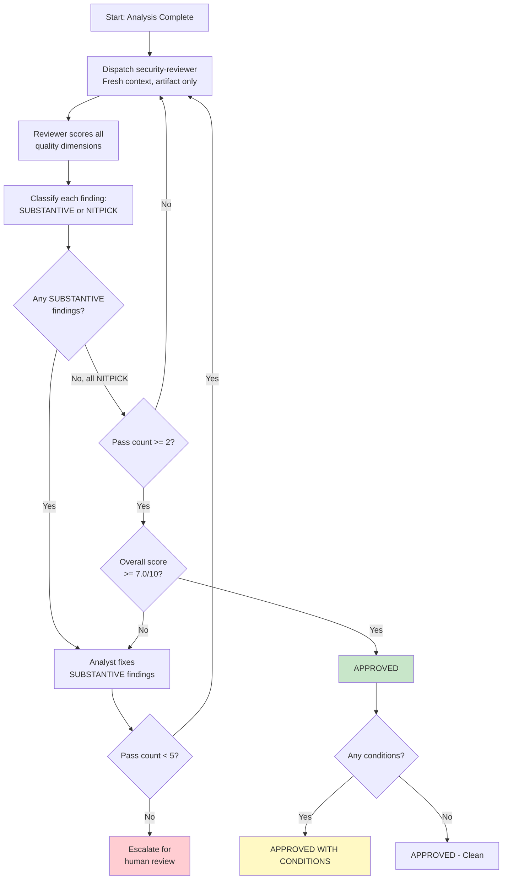

# Adversarial Review Guide

This guide explains how the adversarial convergence loop works in SecOps Factory -- the mechanism that ensures security analysis quality through multi-pass independent review.

## How the Convergence Loop Works



## Key Principles

**Information asymmetry is the mechanism.** The security-reviewer agent does not see the analyst's reasoning, prior review passes, or any orchestrator summaries. Each pass evaluates the artifact with completely fresh eyes. This prevents anchoring to prior findings and ensures each pass is genuinely independent.

**Minimum 2 passes, maximum 5.** One pass is never sufficient -- even if it finds nothing, that could be a prompt failure rather than genuine quality. Two passes with only NITPICK findings establishes convergence. Five passes without convergence indicates a structural problem requiring human escalation.

**Fix, then re-run.** When SUBSTANTIVE findings are identified, the analyst fixes them before the next pass. The next reviewer sees only the updated artifact -- never the prior findings.

## Task-Specific Attack Surfaces

The reviewer focuses on different attack surfaces depending on the analysis type.

### CVE Enrichment Attack Surfaces

- **Technical accuracy:** Are CVSS, EPSS, KEV values verifiable against NVD, FIRST, CISA?
- **Completeness:** Are all 12 template sections populated with substantive content?
- **Actionability:** Can the remediation team execute from this document alone?
- **Contextualization:** Does business context actually influence the priority assessment?
- **Source quality:** Are all claims traced to authoritative sources?
- **ATT&CK mapping:** Are techniques valid for the vulnerability type?
- **Bias detection:** Are there confirmation, anchoring, or automation bias patterns?

### Event Investigation Attack Surfaces

- **Evidence chain:** Can every claim trace back to documented evidence?
- **Disposition logic:** Would a different analyst reach the same conclusion from this evidence?
- **Alternative analysis:** Were genuinely different explanations considered, not straw men?
- **Temporal analysis:** Is the timeline internally consistent?
- **ICS awareness:** Were OT-specific considerations applied (Purdue zones, safety systems)?

## Quality Thresholds

| Threshold | Value | Consequence |
|-----------|-------|-------------|
| Overall score | >= 7.0/10 | Required for approval |
| Any single dimension | >= 5.0/10 | No dimension can fall below 50% |
| Critical findings | 0 | All critical findings must be resolved |

If the overall score is below 7.0 after convergence, the analysis requires rework with specific guidance from the reviewer.

## Cognitive Bias Audit (Mandatory Per Pass)

Every review pass MUST include a cognitive bias assessment. The reviewer checks for:

1. **Confirmation bias** -- only citing sources that confirm the initial assessment
2. **Anchoring bias** -- locked to the initial severity without independent reassessment
3. **Availability bias** -- over-weighting recent similar incidents without checking base rates
4. **Automation bias** -- blindly accepting platform classification without independent verification

These checks reference `data/cognitive-bias-patterns.md` for detection signals and debiasing techniques.

## Strict-Binary Novelty Protocol

After each pass, every finding is classified as exactly one of:

- **SUBSTANTIVE:** Changes the quality model. Examples: new gap discovered, factual error found, missing quality dimension identified, disposition disagreement.
- **NITPICK:** Refines existing understanding. Examples: rephrasing for clarity, formatting improvements, minor enhancements, style preferences.

There is no middle ground. Every finding is either SUBSTANTIVE or NITPICK.

**Convergence criterion:** A pass where ALL findings are NITPICK AND the pass count is >= 2 AND the quality score is >= 7.0/10.

## When the Loop Stops

The loop terminates in one of three states:

| State | Condition | Output |
|-------|-----------|--------|
| APPROVED | All NITPICK + pass >= 2 + score >= 7.0 + 0 critical | Sign-off with dimension scores |
| APPROVED WITH CONDITIONS | Converged but minor items remain | Sign-off with condition list |
| REWORK REQUIRED | Score < 7.0 after convergence, or max 5 passes without convergence | Specific rework guidance |

## What to Do When Findings Persist

If the same SUBSTANTIVE finding appears across multiple passes:

1. The finding is reappearing because it has not been fixed. Verify the fix was applied to the artifact.
2. If fixed but still flagged: the fix may be insufficient. Read the reviewer's specific criticism and address the root cause, not just the surface symptom.
3. If genuinely fixed and still flagged: this indicates a reviewer calibration issue. After 5 passes, the loop escalates for human review.

## Running the Adversarial Review

```
/secops-factory:adversarial-review-secops SEC-1234
```

The command dispatches the security-reviewer agent (Riley) with a forked context. After each pass, findings are classified and the loop continues or terminates per the protocol above.

The output includes:
- Summary of all passes with finding counts per pass
- Novelty classification for each pass (SUBSTANTIVE vs NITPICK counts)
- Final quality score with per-dimension breakdown
- Resolved vs unresolved findings list
- Sign-off recommendation: APPROVED, APPROVED WITH CONDITIONS, or REWORK REQUIRED
