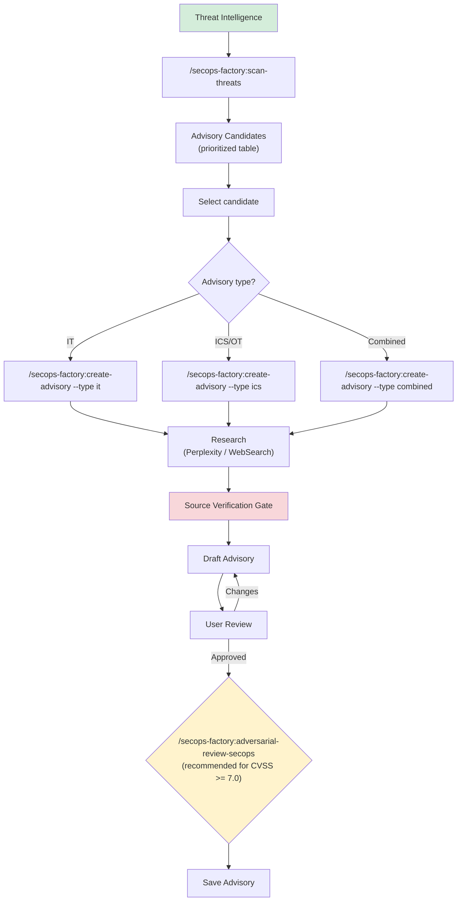

# Advisory Creation Guide

Create structured, actionable security advisories for IT, ICS/OT, or combined audiences.

## Overview



## Quick Start

### Scan for threats first

```
/secops-factory:scan-threats --severity critical --days 7
```

The scan returns a prioritized table of advisory-worthy items. Pick one and create an advisory:

```
/secops-factory:create-advisory CVE-2024-1234
```

### Direct advisory creation

If you already know the topic:

```
/secops-factory:create-advisory CVE-2024-1234 --type ics
```

### Using a custom template

```
/secops-factory:create-advisory CVE-2024-1234 --template ./our-org-advisory-template.md
```

## Advisory Types

When you run `/secops-factory:create-advisory`, the agent asks which audience to target:

| Type | Audience | Key Differences |
|------|----------|----------------|
| **IT** | Enterprise/cloud teams | CIA triad, "patch immediately," WAF rules |
| **ICS/OT** | OT operators, ICS engineers | Safety framing, maintenance windows, NERC CIP, protocol-specific mitigations |
| **Combined** | Both teams | Full template, dual timelines (IT: immediate, OT: coordinated) |

### IT Advisory

Skips the ICS/OT Context section. Uses:
- CIA triad impact assessment
- Standard remediation timelines (Critical: 48h, High: 7d, Medium: 30d)
- Detection rules for IT infrastructure (Sigma, Snort)
- No regulatory references

### ICS/OT Advisory

Includes the ICS/OT Context section with:
- Critical infrastructure sector tagging (energy, water, manufacturing, etc.)
- Safety impact assessment (physical harm potential)
- Affected protocols (Modbus, DNP3, OPC-UA, EtherNet/IP)
- Regulatory references (NERC CIP, IEC 62443, NIST SP 800-82)
- OT-specific mitigations (network segmentation, compensating controls)
- Maintenance-window scheduling for remediation

### Combined Advisory

Addresses both audiences with:
- Dual Executive Summary (IT action + OT action)
- Dual remediation timelines
- Both CIA triad and safety/process impact
- Both IT and OT mitigation sections

## Default Template

The built-in template at `templates/security-advisory-tmpl.md` follows the CSAF Security Advisory profile and CISA ICS-CERT format. It has 12 sections:

1. **Header** — advisory ID, TLP, dates
2. **Executive Summary** — 2-3 sentences for management
3. **Severity** — CVSS, EPSS, KEV, SSVC
4. **Affected Products** — version table
5. **Vulnerability Details** — CVE, CWE, attack vector
6. **ICS/OT Context** (conditional) — sectors, safety, protocols, regulatory
7. **Impact** — CIA + safety
8. **Exploit Status** — KEV, PoC, active exploitation, ransomware
9. **Mitigations** — immediate workarounds
10. **Remediation** — patches with timelines
11. **Detection** — IOCs, YARA/Sigma/Snort rules, log indicators
12. **References** — all sources with URLs

## Custom Templates

Organizations can provide their own template via `--template <path>`. The skill validates that the custom template has at minimum:

- A section with "Executive Summary" or "Summary"
- A section with "Affected" (products, systems, or versions)
- A section with "Remediation" or "Mitigation" or "Action"

Custom templates can:
- Add internal fields (ticket IDs, SLA deadlines, asset owner contacts)
- Override section ordering
- Add branding (org name, distribution list)
- Remove sections not used by the organization
- Add organization-specific regulatory or compliance fields

## Source Verification Gate

Before presenting any advisory, the agent verifies:

- CVSS score matches NVD (or discrepancy documented)
- EPSS score is current (queried within 24h)
- KEV status is current
- Affected version ranges match vendor advisory
- URLs in References resolve
- At least one detection indicator is present

This is enforced by the Iron Law: **NO ADVISORY PUBLICATION WITHOUT SOURCE VERIFICATION FIRST**.

## Threat Scanning

`/secops-factory:scan-threats` searches multiple intelligence sources and scores each candidate:

| Factor | Weight | Scoring |
|--------|--------|---------|
| CVSS severity | 25% | Critical=10, High=8, Medium=5, Low=2 |
| Exploit status | 25% | Active=10, PoC=7, None=2 |
| KEV listing | 15% | Listed=10, Not=0 |
| Sector relevance | 15% | Match=10, Adjacent=5, None=2 |
| Recency | 10% | 24h=10, 7d=7, Older=3 |
| Asset prevalence | 10% | Widespread=10, Niche=3 |

Items scoring >= 6.0 are recommended for advisory creation.

### Sector Filtering

For ICS/OT scans, filter by critical infrastructure sector:

```
/secops-factory:scan-threats --sector energy --severity high --days 14
```

Available sectors: energy, water, manufacturing, transportation, healthcare, all.
