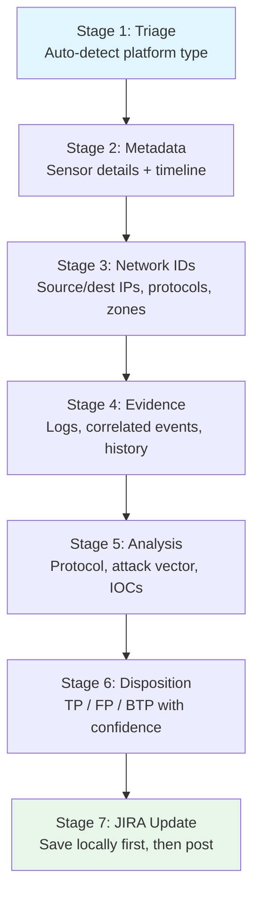
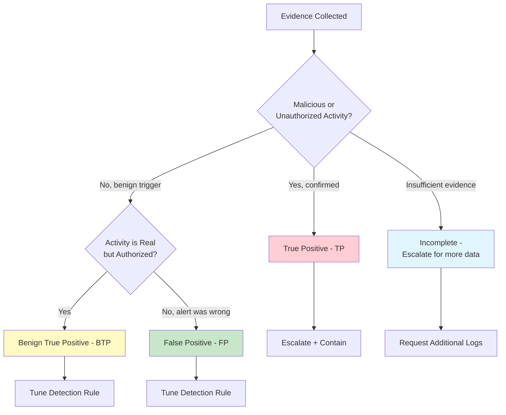

# Event Investigation Guide

This guide covers the complete security event investigation pipeline -- from alert triage through disposition determination and JIRA documentation.

## When to Use

Use `/investigate-event` when you have a JIRA ticket containing a security event alert from an ICS, IDS/IPS, or SIEM platform that needs investigation, evidence-based disposition, and documentation.

## Pipeline Overview



## Disposition Framework

The disposition determination follows a structured decision tree:



**Disposition definitions:**
- **True Positive (TP):** Genuine malicious or unauthorized activity confirmed by evidence. Requires escalation and containment.
- **False Positive (FP):** Benign activity incorrectly flagged by the detection rule. Requires rule tuning.
- **Benign True Positive (BTP):** The activity is real and the detection is correct, but the activity is authorized (e.g., scheduled maintenance, approved scan). Requires rule tuning or exception.

Every disposition must include a confidence level (High, Medium, Low) and at least 2 alternative dispositions that were considered with reasoning for rejection.

## ICS/IDS/SIEM Platform Support

The plugin auto-detects the alert platform from keywords in the JIRA ticket:

| Platform Type | Detection Keywords | Examples |
|---------------|-------------------|----------|
| ICS/SCADA | Claroty, Nozomi, Dragos, CyberX, Modbus, DNP3, PLC, HMI, OPC-UA | Claroty xDome alert, Nozomi Guardian detection |
| IDS/IPS | Snort, Suricata, Palo Alto, Cisco Firepower, SID: | Suricata rule trigger, Firepower IPS event |
| SIEM | Splunk, QRadar, Sentinel, Elastic Security, Notable Event | Splunk notable event, Sentinel incident |

If the platform type is ambiguous, the plugin prompts you to select ICS, IDS, or SIEM.

### ICS-Specific Considerations

When the alert originates from an ICS/SCADA platform:
- Purdue model zone classification is applied (Level 0-5)
- Safety system implications are assessed (SIS/SIL)
- ICS ATT&CK matrix is referenced instead of or in addition to Enterprise ATT&CK
- Protocol-specific analysis is performed (Modbus function codes, DNP3 objects, OPC-UA services)

## Step-by-Step Walkthrough

### Stage 1: Triage and Alert Type Detection (2-3 min)

```
/investigate-event SEC-5678
```

The plugin reads the JIRA ticket and auto-detects the alert platform type. It extracts the initial alert metadata: name, severity, timestamp, source system, and rule ID.

### Stage 2: Alert Metadata Collection (2-3 min)

The plugin captures sensor and platform details, detection engine version, and raw alert data from the ticket. It builds an event timeline:

- **Occurrence:** when the event happened
- **Detection:** when the alert fired
- **Investigation start:** current timestamp

### Stage 3: Network/Host Identifier Documentation (3-4 min)

For each source and destination, the plugin documents:
- IP address, hostname, asset type, criticality, Purdue zone
- Protocol, port, and service identification
- For external IPs: ASN, geolocation, and reputation via Perplexity

If data is missing from the ticket, the plugin prompts you for the required fields.

### Stage 4: Evidence Collection (5-8 min)

This is the most interactive stage. The plugin:
1. Identifies relevant log sources based on the alert type
2. Prompts you for log excerpts (with PII handling notice)
3. Collects correlated events from the same time window
4. Gathers historical context (30/60/90-day patterns)
5. Optionally queries Perplexity for threat intelligence on observed IOCs

Have your log sources accessible before starting. The quality of the disposition depends directly on the quality of evidence collected.

### Stage 5: Technical Analysis (4-6 min)

The plugin performs:
- **Protocol/port validation:** Is this traffic legitimate for the observed protocol and port?
- **Attack vector analysis:** Maps to MITRE ATT&CK tactics and techniques
- **Log interpretation:** Identifies anomalies and indicators of compromise
- **Threat intelligence correlation:** Checks observed IOCs against threat feeds via Perplexity
- **Asset context:** Evaluates the function, business impact, and environment of affected systems

### Stage 6: Disposition Determination (3-5 min)

The plugin presents the evidence summary and applies the disposition framework:

1. Evaluates evidence for/against each disposition (TP, FP, BTP)
2. Selects the disposition with the strongest evidence
3. Assigns a confidence level (High, Medium, Low)
4. Documents the reasoning chain from evidence to conclusion
5. Records at least 2 alternative dispositions considered with reasoning for rejection
6. Determines escalation requirements and next actions

If confidence is Low, the plugin automatically recommends escalation for additional investigation.

### Stage 7: Documentation and JIRA Update (2-3 min)

The plugin generates the investigation document from the `event-investigation-tmpl.yaml` template, saves it locally first (chain of custody), then posts it as a JIRA comment and updates custom fields (disposition, confidence, next actions, investigation duration).

**Important:** The local save happens before the JIRA update. This preserves chain of custody -- if the JIRA update fails, the investigation is not lost.

## Quality Dimensions (7)

After investigation, quality is assessed across 7 weighted dimensions:

| # | Dimension | Weight | Checklist | What It Measures |
|---|-----------|--------|-----------|------------------|
| 1 | Completeness | 25% | `investigation-completeness-checklist.md` | All investigation steps performed, all data fields populated |
| 2 | Technical Accuracy | 20% | `investigation-technical-accuracy-checklist.md` | IP, protocol, and log interpretation correctness |
| 3 | Disposition Reasoning | 20% | `disposition-reasoning-checklist.md` | Evidence-based TP/FP/BTP with alternatives considered |
| 4 | Contextualization | 15% | `investigation-contextualization-checklist.md` | Asset criticality, business impact, zone classification |
| 5 | Methodology | 10% | `investigation-methodology-checklist.md` | Hypothesis-driven approach, multiple source correlation |
| 6 | Documentation | 5% | `investigation-documentation-quality-checklist.md` | Structure, clarity, timestamps, readability |
| 7 | Cognitive Bias | 5% | `investigation-cognitive-bias-checklist.md` | 6 bias types checked including automation bias |

**Weighted score:** Sum of (dimension score x weight).

**Classification:** Excellent (90-100%), Good (75-89%), Needs Improvement (60-74%), Inadequate (<60%).

## Cognitive Bias Mitigation

Every investigation is checked for these cognitive biases:

| Bias | Detection Signal | Mitigation |
|------|-----------------|------------|
| Confirmation | Only seeking evidence that supports the initial hypothesis | Actively seek disconfirming evidence |
| Anchoring | Locked to the initial alert severity without reassessment | Re-derive severity from raw evidence independently |
| Availability | Over-weighting recent similar incidents | Check base rates and historical data (30/60/90 days) |
| Automation | Blindly accepting platform classification (Claroty says malicious) | Independently verify the platform's disposition |
| Overconfidence | High-confidence claims without proportional evidence | Require evidence for every claim |
| Recency | Only considering recent events, ignoring historical patterns | Check 30/60/90-day patterns before concluding |

The bias-check-reminder hook fires after every Perplexity research query, reminding the analyst to check for bias in how they interpret results.

## Adversarial Review of Investigation

For high-severity events or when confidence in the disposition is Medium or Low:

```
/review-enrichment SEC-5678
```

The review skill auto-detects the event investigation type and applies the 7-dimension weighted rubric. The reviewer independently forms a disposition before reading the analyst's conclusion.

For convergence-level assurance:

```
/adversarial-review-secops SEC-5678
```

## Example Session

```
> /investigate-event SEC-5678

I am using the investigate-event skill to run the complete 7-stage
event investigation workflow for SEC-5678.

Stage 1: Triage
  Platform detected: ICS/SCADA (Claroty xDome)
  Alert: Unauthorized Modbus Write to PLC
  Severity: Critical
  Rule ID: CLR-2024-0891

Stage 2: Metadata
  Sensor: Claroty xDome v4.2
  Occurrence: 2024-11-15T03:42:18Z
  Detection: 2024-11-15T03:42:19Z (1s latency)

Stage 3: Network IDs
  Source: 10.50.2.15 (EWS-03, Engineering Workstation, Zone 3)
  Destination: 10.50.1.8 (PLC-FEED-01, Allen-Bradley ControlLogix, Zone 1)
  Protocol: Modbus/TCP, Port 502
  Function: Write Multiple Registers (FC 16)

Stage 4: Evidence Collection
  [Prompting for Claroty alert details...]
  [Prompting for Modbus traffic logs...]
  Historical: 3 similar events in past 90 days, all during maintenance windows

Stage 5: Analysis
  ATT&CK: T0843 - Program Upload (ICS)
  Protocol: FC 16 is a write function -- legitimate for programming but
  high-risk outside maintenance windows
  Context: No maintenance window scheduled for this time

Stage 6: Disposition
  Disposition: True Positive (TP)
  Confidence: High
  Reasoning: Unauthorized Modbus write from engineering workstation to
  production PLC outside scheduled maintenance window. No change
  management ticket correlates.
  Alternatives considered:
    - BTP (authorized maintenance): Rejected -- no CM ticket, outside window
    - FP (sensor misconfiguration): Rejected -- FC 16 correctly classified

Stage 7: Documentation and JIRA Update
  Investigation saved locally to artifacts/investigations/SEC-5678.md
  Posted investigation as JIRA comment
  Updated fields: disposition=TP, confidence=High, next_actions=Escalate
```
