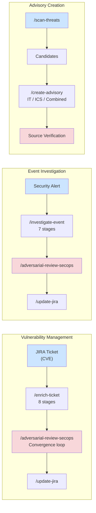

# Getting Started with SecOps Factory

This guide walks you through installing SecOps Factory, configuring MCP servers, and running your first vulnerability enrichment and event investigation.

## SecOps Factory Workflows



## Prerequisites

Before you begin, ensure you have:

- **Claude Code** installed and running
- **jr CLI** installed ([github.com/Zious11/jira-cli](https://github.com/Zious11/jira-cli)) — Rust CLI for JIRA Cloud
- **JIRA Cloud** access with API credentials (email + API token)
- **Perplexity API key** (recommended for AI-assisted CVE research; plugin falls back to web search if not configured)
- A JIRA project configured for security tickets

## Installation

### From the Claude Code plugin marketplace

Search for `secops-factory` in the Claude Code plugin marketplace and install it.

### From source

Clone the repository and register it as a local plugin:

```bash
git clone https://github.com/drbothen/secops-factory.git
```

## JIRA Configuration (jr CLI)

SecOps Factory uses the `jr` CLI for all JIRA operations. Install and authenticate:

```bash
# Install jr (Rust, single binary)
cargo install jira-cli-rs
# or download from https://github.com/Zious11/jira-cli/releases

# Authenticate with JIRA Cloud
jr auth login
```

This stores your credentials in the system keychain. Configuration lives at `~/.config/jr/config.toml`.

The plugin uses these `jr` commands via Bash:

| Command | Purpose |
|---------|---------|
| `jr issue view KEY` | Read ticket data |
| `jr issue edit KEY` | Update fields (priority, labels, etc.) |
| `jr issue comment KEY "msg"` | Post enrichment and review comments |
| `jr issue move KEY STATUS` | Transition ticket status |
| `jr issue list --jql "..."` | Search for tickets |
| `jr issue assets KEY` | Fetch linked CMDB assets |

## MCP Server Configuration

### Perplexity MCP Server

The Perplexity MCP server provides AI-assisted CVE research with web-grounded results. You need:

1. **Perplexity API key** -- obtain from [perplexity.ai](https://www.perplexity.ai/)

The plugin selects the Perplexity tool tier based on CVE severity:

| CVSS Score | Tool | Response Time |
|------------|------|---------------|
| 9.0-10.0 (Critical) | `perplexity_research` | 2-5 minutes |
| 7.0-8.9 (High) | `perplexity_reason` | 30-60 seconds |
| 0.1-6.9 (Medium/Low) | `perplexity_search` | 10-20 seconds |
| Unknown | `perplexity_reason` | 30-60 seconds |

### Verify MCP Configuration

Run the health check to confirm both servers are reachable:

```
/secops-health
```

You should see PASS for jr CLI and Perplexity MCP. If jr fails, run `jr auth login`. If Perplexity fails, the plugin will fall back to web search.

## First Enrichment Walkthrough

This walkthrough enriches a JIRA security ticket containing a CVE.

### Step 1: Read the ticket

```
/read-ticket SEC-1234
```

The plugin fetches the JIRA ticket and extracts CVE IDs, affected systems, asset criticality, and other metadata. Review the extracted data to confirm the CVE ID and affected systems are correct.

### Step 2: Run the full enrichment

```
/enrich-ticket SEC-1234
```

The plugin executes all 8 stages automatically:

1. **Triage** -- extracts CVE-2024-12345 from the ticket
2. **CVE Research** -- queries Perplexity for CVSS, EPSS, KEV, exploits, patches
3. **Business Context** -- assesses asset criticality and system exposure
4. **Remediation** -- identifies patches, workarounds, and compensating controls
5. **ATT&CK Mapping** -- maps to MITRE tactics and techniques with T-numbers
6. **Priority Assessment** -- calculates 6-factor score, assigns P1-P5 with SLA
7. **Documentation** -- generates structured enrichment document from template
8. **JIRA Update** -- posts enrichment as comment and updates custom fields

The entire workflow takes 10-15 minutes. Do not interrupt mid-workflow -- partial enrichment is blocked by the enrichment-completeness hook.

### Step 3: Review the enrichment

```
/review-enrichment SEC-1234
```

The security-reviewer agent (Riley) evaluates the enrichment across 8 quality dimensions and produces a scored review report. If the score meets the 7.0/10 threshold, the enrichment is approved. If not, the review identifies specific gaps to fix.

### Step 4: Run adversarial convergence (optional)

```
/adversarial-review-secops SEC-1234
```

This dispatches the security-reviewer in fresh-context passes until convergence. Use this for high-priority tickets (P1/P2) or when extra confidence is needed.

## First Event Investigation Walkthrough

This walkthrough investigates a security event alert from an ICS, IDS, or SIEM platform.

### Step 1: Read the alert ticket

```
/read-ticket SEC-5678
```

The plugin reads the JIRA ticket and auto-detects the alert platform type (ICS, IDS, or SIEM) from keywords in the ticket content.

### Step 2: Run the full investigation

```
/investigate-event SEC-5678
```

The plugin executes all 7 stages:

1. **Triage** -- detects platform type (Claroty, Snort, Splunk, etc.)
2. **Metadata** -- captures sensor details and builds event timeline
3. **Network IDs** -- documents source/destination IPs, protocols, zones
4. **Evidence** -- collects logs, correlated events, and historical context
5. **Analysis** -- performs protocol validation, attack vector analysis, IOC identification
6. **Disposition** -- determines TP, FP, or BTP with confidence level and alternatives
7. **JIRA Update** -- saves locally first (chain of custody), then posts to JIRA

The plugin will prompt you for log excerpts and evidence during Stage 4. Have your log sources accessible.

### Step 3: Review the investigation

```
/review-enrichment SEC-5678
```

The review skill auto-detects the event investigation type and applies the 7-dimension weighted rubric. The reviewer independently forms a disposition before reading the analyst's conclusion, ensuring genuine quality validation.

## Understanding the Adversarial Review Loop

The adversarial review loop is the core quality mechanism in SecOps Factory. Here is how it works:

1. **Pass 1:** The security-reviewer agent evaluates the artifact with fresh context. It has not seen the analyst's reasoning or any prior reviews. It scores quality across all dimensions and identifies findings.

2. **Novelty classification:** Each finding is classified as SUBSTANTIVE (changes the quality model) or NITPICK (refines existing understanding). If any findings are SUBSTANTIVE, the analysis is not converged.

3. **Fix and re-run:** The analyst fixes SUBSTANTIVE findings. A new pass is dispatched -- again with fresh context. The reviewer does not see prior passes.

4. **Convergence:** When a pass produces only NITPICK findings AND the minimum 2 passes have completed AND the quality score is at least 7.0/10, the analysis is converged and approved.

5. **Escalation:** If convergence is not reached after 5 passes, the analysis is escalated for human review.

This information asymmetry -- the reviewer never sees prior passes -- is what makes the mechanism effective. It prevents anchoring to prior findings and ensures each pass is genuinely independent.

## Next Steps

- Read the [Vulnerability Enrichment Guide](vulnerability-enrichment.md) for detailed CVE enrichment documentation
- Read the [Event Investigation Guide](event-investigation.md) for detailed event investigation documentation
- Read the [Adversarial Review Guide](adversarial-review.md) for convergence loop details
- Review the [Commands Reference](commands-reference.md) for all available commands
