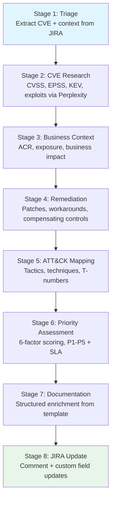

# Vulnerability Enrichment Guide

This guide covers the complete CVE enrichment pipeline -- from JIRA ticket triage through structured documentation and JIRA update.

## When to Use

Use `/secops-factory:enrich-ticket` when you have a JIRA security ticket containing one or more CVE IDs that needs vulnerability intelligence, risk assessment, and remediation guidance.

## Pipeline Overview



## Prerequisites

- `jr` CLI installed and authenticated (`jr auth login`)
- Perplexity MCP server connected with API key
- A JIRA ticket containing a CVE ID in the summary, description, or custom fields
- Run `/secops-factory:secops-health` to verify all dependencies

## Step-by-Step Walkthrough

### Stage 1: Triage and Context Extraction (1-2 min)

```
/secops-factory:read-ticket SEC-1234
```

The plugin reads the JIRA ticket and extracts:
- CVE ID(s) from summary, description, and custom fields
- Affected systems and components
- Initial severity from the ticket
- Context metadata (labels, priority, assignee)

If no CVE ID is found in the ticket, the plugin prompts you to provide one manually.

**Output:** `cve_id`, `all_cves`, `affected_systems`, `initial_severity`, `ticket_summary`

### Stage 2: AI-Assisted CVE Research (3-5 min)

```
/secops-factory:research-cve CVE-2024-12345
```

The plugin queries Perplexity for comprehensive vulnerability intelligence. The tool tier is selected based on CVSS severity:

| CVSS | Tool | Time |
|------|------|------|
| 9.0+ | `perplexity_research` | 2-5 min |
| 7.0-8.9 | `perplexity_reason` | 30-60s |
| <7.0 | `perplexity_search` | 10-20s |

**Data collected:**
- CVSS base score and vector string (verified against NVD)
- EPSS exploitation probability (verified against FIRST)
- CISA KEV catalog status
- Affected product and version ranges
- Patched versions and vendor advisory links
- Exploit availability (PoC, public exploit, active exploitation)
- MITRE ATT&CK tactic and technique suggestions
- CWE classification

**Source hierarchy for conflicts:** NVD > Vendor > Third-party for CVSS. Vendor > NVD for patches. CISA > vendors for exploitation status.

### Stage 3: Business Context Assessment (2-3 min)

The plugin assesses the business context of the affected systems:

- **Asset Criticality Rating (ACR):** Critical, High, Medium, or Low -- extracted from JIRA custom fields or provided by the analyst
- **System Exposure:** Internet-facing, Internal, or Isolated
- **Business Impact:** assessed across confidentiality, integrity, and availability dimensions

If ACR or exposure data is not available in the ticket, the plugin prompts you for it. Never skip this stage -- context always matters.

### Stage 4: Remediation Planning (2-3 min)

The plugin identifies remediation options:

- **Patches:** available vendor patches with version numbers
- **Workarounds:** temporary mitigations if no patch is available
- **Compensating controls:** network segmentation, WAF rules, monitoring
- **Remediation steps:** actionable, step-by-step guidance the remediation team can execute

Even when no patch exists, this stage documents workarounds and compensating controls. "No patch" does not mean "no remediation."

### Stage 5: MITRE ATT&CK Mapping (1-2 min)

```
/secops-factory:map-attack CVE-2024-12345
```

The plugin maps the vulnerability to MITRE ATT&CK:

- Primary tactic (e.g., Initial Access, Execution)
- Specific techniques with T-numbers (e.g., T1190 Exploit Public-Facing Application)
- Confidence level: CONFIRMED (from threat intelligence) or INFERRED (from vulnerability type)
- Detection recommendations for each technique
- ICS ATT&CK techniques if the target environment is OT/SCADA

### Stage 6: Multi-Factor Priority Assessment (1-2 min)

```
/secops-factory:assess-priority SEC-1234
```

The plugin calculates priority using 6 factors:

| Factor | Range | Scoring |
|--------|-------|---------|
| CVSS Severity | 0-4 pts | >=9.0=4, >=7.0=3, >=4.0=2, <4.0=1 |
| EPSS Probability | 0-4 pts | >=0.75=4, >=0.50=3, >=0.25=2, <0.25=1 |
| CISA KEV Status | 0-5 pts | Listed=5, Not Listed=0 |
| Asset Criticality | 0-4 pts | Critical=4, High=3, Medium=2, Low=1 |
| System Exposure | 0-3 pts | Internet=3, Internal=2, Isolated=1 |
| Exploit Availability | 0-4 pts | Active=4, Public=3, PoC=2, Theoretical=1 |

**Total: 0-24 points**

| Score | Priority | SLA |
|-------|----------|-----|
| >=20 or KEV Listed | P1 - Critical | 24 hours |
| 15-19 | P2 - High | 7 days |
| 10-14 | P3 - Medium | 30 days |
| 6-9 | P4 - Low | 90 days |
| 0-5 | P5 - Informational | No SLA |

**Override rules:**
- KEV Listed + Internet + Critical ACR = automatic P1
- Active Exploitation + CVSS >=9.0 + High/Critical ACR = automatic P1
- Compliance requirement = elevate +1 level
- Documented compensating controls = reduce -1 level

### Stage 7: Structured Documentation (1 min)

The plugin generates a structured enrichment document from the `security-enrichment-tmpl.yaml` template. All sections are populated with data collected in Stages 1-6. The enrichment-completeness hook blocks saving if required sections are missing.

### Stage 8: JIRA Update and Validation (1-2 min)

```
/secops-factory:update-jira SEC-1234
```

The plugin posts the enrichment document as a JIRA comment and updates custom fields (CVSS, EPSS, KEV, priority). The require-review hook blocks field updates until review approval is obtained -- run `/secops-factory:review-enrichment` first.

## Quality Dimensions (8)

After enrichment, quality is assessed across 8 dimensions:

| # | Dimension | Checklist | What It Measures |
|---|-----------|-----------|------------------|
| 1 | Technical Accuracy | `technical-accuracy-checklist.md` | CVSS, EPSS, KEV values verified against authoritative sources |
| 2 | Completeness | `completeness-checklist.md` | All 12 template sections populated with substantive content |
| 3 | Actionability | `actionability-checklist.md` | Specific patches, clear SLA, concrete next steps |
| 4 | Contextualization | `contextualization-checklist.md` | ACR, exposure, and business impact considered |
| 5 | Documentation Quality | `documentation-quality-checklist.md` | Structure, clarity, readability |
| 6 | ATT&CK Mapping | `attack-mapping-validation-checklist.md` | Valid tactics and techniques with T-numbers |
| 7 | Cognitive Bias | `cognitive-bias-checklist.md` | 5 bias types checked |
| 8 | Source Citation | `source-citation-checklist.md` | Authoritative sources cited for all claims |

**Scoring:** (Passed / Total) x 100 per dimension. Average across all 8 for overall score.

**Classification:** Excellent (90-100%), Good (75-89%), Needs Improvement (60-74%), Inadequate (<60%).

## Adversarial Review of Enrichment

For P1/P2 tickets or when extra confidence is needed:

```
/secops-factory:adversarial-review-secops SEC-1234
```

The adversarial review dispatches the security-reviewer agent in fresh-context passes. Each pass evaluates all 8 quality dimensions and identifies findings classified as SUBSTANTIVE or NITPICK. The loop continues until convergence (all NITPICK) with a minimum of 2 passes.

## Red Flags

Watch for these patterns during enrichment:

| Red Flag | Why It Matters |
|----------|---------------|
| Skipping CVE research because the ticket has a CVSS score | Ticket data may be stale or wrong. Always verify against NVD. |
| Skipping EPSS | EPSS is required for multi-factor priority. Never skip. |
| Updating JIRA before completing all 8 stages | Iron Law violation. Partial enrichment creates false confidence. |
| Using vendor severity alone for priority | Vendor assessment is one factor. Run full 6-factor scoring. |
| Skipping remediation because no patch exists | Document workarounds and compensating controls instead. |
| Treating KEV absence as low risk | KEV absence does not mean low risk. Check EPSS and exploit status. |
| Citing blog posts as authoritative sources | Use NVD, CISA, FIRST, vendor advisories, GitHub advisories. |
| Skipping business context | Every CVE needs ACR + exposure assessment. Context always matters. |

## Example Session

```
> /secops-factory:enrich-ticket SEC-1234

I am using the enrich-ticket skill to run the complete 8-stage
enrichment workflow for SEC-1234.

Stage 1: Triage -- extracted CVE-2024-12345 from ticket summary.
  Affected systems: web-proxy-01, web-proxy-02
  Initial severity: High

Stage 2: CVE Research -- querying Perplexity (perplexity_reason)...
  CVSS: 8.1 (High), Vector: CVSS:3.1/AV:N/AC:H/PR:N/UI:N/S:U/C:H/I:H/A:H
  EPSS: 0.42 (67th percentile)
  KEV: Not Listed
  Exploit: PoC available on GitHub
  Patches: v2.4.58 (vendor advisory SA-2024-001)

Stage 3: Business Context
  ACR: High (production web proxies)
  Exposure: Internet-facing
  Business Impact: High (customer-facing services)

Stage 4: Remediation
  Patch: Upgrade to v2.4.58
  Workaround: Restrict access to management interface
  Compensating: WAF rule for exploit pattern

Stage 5: ATT&CK Mapping
  T1190 - Exploit Public-Facing Application (CONFIRMED)
  T1059 - Command and Scripting Interpreter (INFERRED)

Stage 6: Priority Assessment
  CVSS: 3/4, EPSS: 2/4, KEV: 0/5, ACR: 3/4, Exposure: 3/3, Exploit: 2/4
  Total: 13/24 -> P3 - Medium (30-day SLA)

Stage 7: Documentation -- generated from template, all sections populated.

Stage 8: JIRA Update -- review approval required. Run /secops-factory:review-enrichment first.
```
